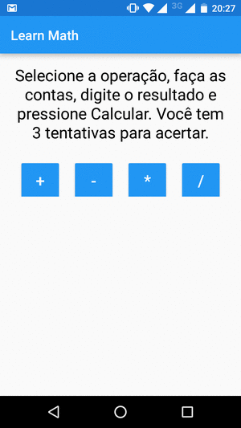

<!--Repositório destinado ao projeto final do curso Android Development for Beginners.-->

# [ Learn Math ]

Simple application to help children to learn the basic math operations. Choose the operation, calculate the result of the operation generated and answer.

<!--a href="" target="_blank">[DOWNLOAD]</a-->

## Release History

* 1.0.0 First version
